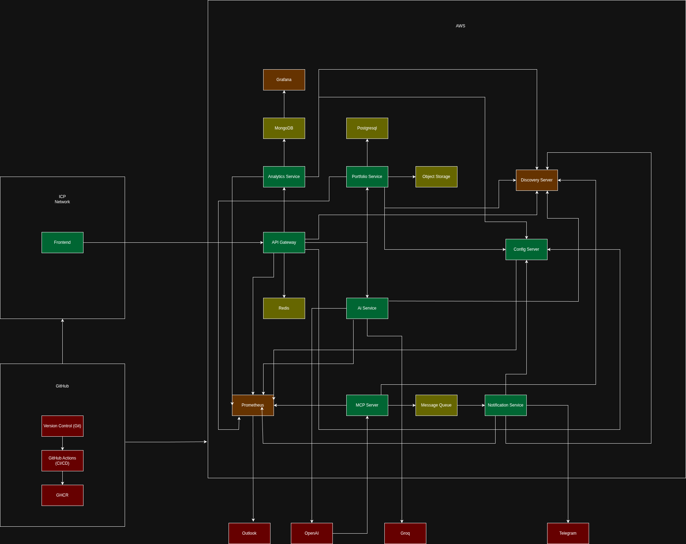

# AI‑Microservices Portfolio

**Copyleft © _2026_ Gopikrishnan Rajeev**  
This repository contains the source for a **cloud‑native, AI‑powered portfolio application**.  
It is built as a polyglot microservice system – the **frontend runs on the DFINITY Internet Computer (ICP)** while the **backend services run on AWS** – and is designed to demonstrate real‑world engineering practices, modern toolchains, observability, AI/ML integration, and a complete CI/CD‑driven software development lifecycle.

---

## 📌 Architecture Overview

<!-- add your architecture diagram here -->


**High‑level components**

- **Frontend**  
  - React + Vite + TailwindCSS with GSAP animations, Three.js 3D canvas and a live AI chat widget.  
  - Packaged as an ICP `assets` canister (`frontend/dfx.json`) and deployed on the Internet Computer.  
  - Consent‑aware Google‑style analytics banner and visitor tracking.
  
- **Backend microservices (Java – Spring Boot)**  
  - `portfolio-service` – CRUD API for skills, projects, work‑experience, testimonials.  
  - `analytics-server` – visitor analytics dashboard using MongoDB.  
  - `notification-service` – sends emails/Telegram messages.  
  - `api-gateway` – Spring Cloud Gateway with rate‑limiting and routing.  
  - `config-server` – centralized configuration via Spring Cloud Config.  
  - All services expose `/actuator/health`/`info`/`prometheus` endpoints and can register with Consul.

- **Python services**  
  - `ai-service` – FastAPI AI chatbot (LangChain + OpenAI/GROQ). Stores chat history in PostgreSQL; uses FAISS vectors.  
  - `mcp-server` – Messaging Control Plane (MCP) for sending messages via RabbitMQ; includes auth and Prometheus metrics.

- **Infrastructure & Observability**  
  - PostgreSQL (multiple databases), MongoDB, Redis, RabbitMQ, MinIO.  
  - Prometheus node‑exporter, Grafana dashboards (see `deployments/grafana-dashboards`).  
  - Consul for optional service discovery.  
  - Docker‑Compose manifests for local development and AWS single‑instance deployment (`deployments/…`).  
  - Alerts defined in `alerts.yml`.

---

## 🚀 Features

- AI chat widget powered by LLMs with recruitment‑oriented instructions.  
- Messaging tool available to LLM.
- Visitor analytics with cookie consent banner (`CookieBanner.jsx`).  
- Dynamic content fetching from backend services.  
- CRUD operations with duplicate prevention, soft deletes.  
- File uploads & presigned URLs via S3/MinIO abstraction.  
- Health check library shared across Python services.  
- Fluid animated UI with scroll‑triggered reveals.  
- 3D WebGL background (`LiquidEther.jsx`) and hero island (`HeroThree.jsx`).  


---

## 🛠 Technology Stack

| Layer        | Technologies |
|--------------|--------------|
| Frontend     | React, Vite, TailwindCSS, GSAP, Three.js, react-three-fiber, Lottie |
| Java Backend | Java 21, Spring Boot, Spring Data JPA, Spring Cloud (Gateway, Config), Lombok, Jakarta Validation |
| Python APIs  | Python 3.13, FastAPI, SQLAlchemy, Alembic, LangChain, FAISS, Prometheus Instrumentator |
| Databases    | PostgreSQL, MongoDB, Redis |
| Messaging    | RabbitMQ, MCP framework |
| Storage      | MinIO/S3-compatible, presigned URLs |
| Observability| Prometheus, Grafana, Consul, psutil |
| Deployment   | Docker Compose, NGINX, AWS EC2/cloud‑init, ICP canisters |
| CI/CD        | GitHub Actions workflows covering build, test, lint, containerization, deployment |
| Misc         | OpenAI/GROQ, MCP, Node/React ecosystem |

---

## 🛠 Development & Local Setup

1. **Clone repository**

   ```sh
   git clone https://github.com/gopikrishnanrmg/Portfolio.git
   cd Portfolio
   ```

2. **Infrastructure**

   ```sh
   cd deployments
   docker compose --profile infra --profile services up -d
   ```
   - Spins up Postgres, Mongo, Redis, RabbitMQ, MinIO, Consul, Prometheus, Grafana, etc.
   - Environment variables come from `deployments/.env`.

3. **Frontend**

   ```sh
   cd ../frontend
   npm install
   npm run dev         # start dev server
   npm run build       # produce `dist` for ICP deploy
   ```

   - `frontend/public/config.js` is generated at runtime; inspect `window.RUNTIME_CONFIG`.

4. **Java Services**

   From each service directory (e.g. `backend/portfolio-service`):

   ```sh
   ./mvnw spring-boot:run -Dspring-boot.run.profiles=local
   # or build jar and run:
   ./mvnw clean package
   java -jar target/*.jar
   ```

5. **Python Services**

   ```sh
   cd backend/ai-service
   python -m venv .venv && source .venv/bin/activate
   pip install -r requirements.txt
   alembic upgrade head
   uvicorn app.main:app --reload
   ```

   Repeat similar steps for `mcp-server`.

6. **Access URLs**

   - Frontend: `http://localhost:3000`
   - AI Chat: `http://localhost:8885/api/v1/chat`
   - MCP Server: `http://localhost:8884`
   - Portfolio API (via gateway): `http://localhost:8887/portfolio/api/v1/...`

---

## ☁️ Deployment

### AWS Single‑Instance

- Uses cloud‑init script in `deployments/aws/singleinstance/user-data-template/user-data`.
- NGINX reverse proxy configured by `nginx.conf` and Cloudflare tunnels.
- Services orchestrated with `docker-compose.yml` located in the same directory.
- Prometheus and Grafana pre‑configured with alerting rules (`alerts.yml`).

### DFINITY Internet Computer

- Frontend assets are built and pushed to an ICP canister (`frontend/dfx.json`).
- Backend continues to run on AWS – the ICP host simply serves static files.

---

## 🧪 Testing

- Java: JUnit & Mockito unit/integration tests under `src/test/java`. Example: [`AnalyticsIntegrationTest`](backend/analytics-server/src/test/java/com/analytics/analytics_server/integration/AnalyticsIntegrationTest.java) demonstrates Testcontainers/MongoDB.
- Python: pytest can be used (tests directory not shown here).

---

## 🔍 Observability & Health

- Each service exposes:
  - `/actuator/health`, `/actuator/info` (Java) or equivalent FastAPI endpoints.
  - `/actuator/prometheus` for Prometheus scraping.
- Health checks modularised in Python (`app/services/health_checks/*`).
- Alerts defined in `alerts.yml` for Spring Boot metrics, Postgres, node CPU/disk.
- Grafana configured with dashboards (see `deployments/grafana-dashboards`).

---

## 📁 Repository Structure

```
.
├── backend/
│   ├── ai-service/          # Python FastAPI + LLM
│   ├── analytics-server/    # Java Spring Boot
│   ├── api-gateway/
│   ├── config-server/
│   ├── mcp-server/          # Python FastAPI MCP
│   ├── notification-service/
│   └── portfolio-service/
├── deployments/             # Docker compose, AWS templates, grafana dashboards
├── frontend/                # React + Vite UI
└── .github/                 # CI workflows
```

---

## 🎯 Why This Project?

This portfolio showcases:

- Full‑stack development across Java, Python and JavaScript.
- Microservices design with independent deployment/separation of concerns.
- AI/ML integration (vector search, LLMs, custom instructions).
- Cloud and blockchain deployment experience.
- Observability, health checks, alerting and containerised infrastructure.
- Clean code, DTOs, validation, and automated testing.
- Real‑world tooling: Docker, Prometheus, Grafana, RabbitMQ, Consul, GitHub Actions.

---

## 📄 License

This project is licensed under the [GNU GPL v3](https://www.gnu.org/licenses/gpl-3.0.html).

---

_For any questions, email [gopikrishnan.rmg@outlook.com](mailto:gopikrishnan.rmg@outlook.com) or use the chat widget on the live site._
